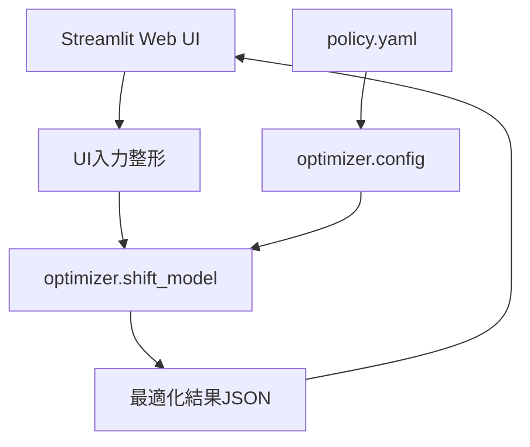

# 設計書

## 概要
本機能は、看護師シフト最適化エンジンと Streamlit ベースの Web UI を統合し、病棟運用に必要な制約を満たす勤務表を自動作成する。

現行実装では以下を提供する。
- 高度な Hard/Soft 制約を設定可能な最適化
- 実行不能時の原因分析と UI 上での推奨修正提案
- 日本語 UI とカレンダー形式の結果表示
- 手動調整と JSON エクスポート

## 設計方針
- 既存アーキテクチャ（`optimizer` に最適化ロジック、`scripts` に UI/CLI）を維持する
- 入力モデル正規化後にソルバーへ渡し、UI から直接ソルバー内部を操作しない
- Hard 制約は必須充足、Soft 制約は重み付きペナルティ最小化で扱う
- UI は非専門家でも調整意図が理解できる説明を優先する

## 要求トレーサビリティ

| Requirement | 実装コンポーネント | 主な実装点 |
|---|---|---|
| 1 | `optimizer/shift_model.py` | 入力正規化、必須項目検証、型変換 |
| 2 | `optimizer/shift_model.py` | 需要充足、1日1勤務、夜勤後制約、週次/法定上限 |
| 3 | `optimizer/shift_model.py` | 希望違反、公平性、スキル優先の目的関数 |
| 4 | `optimizer/shift_model.py`, `scripts/run_shift_web_ui.py` | 結果サマリー、違反情報、JSON 出力 |
| 5 | `policy.yaml`, `optimizer/config.py` | 時間制限、重み、実行ポリシー反映 |
| 6 | `scripts/run_shift_web_ui.py` | 入力 UI、進捗・結果表示、手動調整 |
| 7 | `optimizer/shift_model.py` | 高度な Hard 制約（登録/病棟/支援/新人/夜勤など） |
| 8 | `optimizer/shift_model.py`, `scripts/run_shift_web_ui.py` | 高度な Soft 制約重みと UI 入力 |

## アーキテクチャ

## 入力モデル

### 看護師属性
- `id`, `skills`, `max_shifts`
- `registered`, `novice`, `experienced`
- `employment`, `suspended`, `ward`, `support_staff`
- `leave_dates`, `forbidden_following`

### 日別需要
- `date`, `shift_type`, `required_count`
- `required_skills`, `ward`, `is_support`, `holiday`
- `needs_experienced`, `needs_icu`

### ルール・重み
- Hard 側: `enforce_exact_demand`, `enforce_required_skills_hard`, `min_rest_days_per_week` など
- Soft 側: `fairness_weight`, `weekend_fairness_penalty`, `holiday_fairness_penalty`, `novice_with_experienced_penalty` など

## 最適化ロジック設計

### Hard 制約
- シフト必要人数の充足
- 看護師ごとの 1 日 1 勤務
- 週次上限勤務日数（Mon-Sun）
- 月間労働時間上限、月間夜勤上限
- 夜勤シフトに登録看護師を最低 1 名
- 新人単独夜勤禁止
- 連続勤務日数上限
- 週 1 日以上の休養日
- 希望休・休職・停止日の割当禁止
- 病棟一致制約、支援要員制約
- 夜勤後の禁止遷移（例: 夜勤→早番禁止）

### Soft 制約
- 希望違反最小化
- 勤務回数の公平性
- 夜勤公平性、週末公平性、祝日公平性
- 連続夜勤抑制
- スキル優先違反ペナルティ
- 新人と経験者の同席推奨
- 急激なシフト遷移抑制
- 外部/支援要員利用最小化

## 実行不能分析設計

### 分析出力
`constraints_summary.analysis` に原因候補を返す。
- 需要総量に対する供給不足
- スキル要件に対する有資格者不足
- 夜勤登録看護師不足
- 週次上限・休養制約により利用可能人数が不足

### UI での対応
- 原因を日本語で表示
- 「推奨パラメータを自動提案」ボタンで、代表的な緩和策を適用
- 例: 最大勤務回数 `+1`、必要人数厳密一致 `OFF`、制約重みの調整

## UI/UX 設計

### レイアウト
- 左ペーン: 入力（期間、看護師、需要、制約）
- 右ペーン: 実行結果（サマリー、カレンダー、違反、エクスポート）
- セクション間に十分な余白を確保
- カードに大きめ角丸と Soft Shadow を適用

### 視認性
- オフホワイト背景と高コントラスト文字色
- 凡例やサマリー値の文字色を黒系に統一
- フォーム入力文字色のコントラスト担保

### 操作性
- 「開始日」「計画日数」に連動して日別必要人数表を動的再構築
- 各日付の必要人数にデフォルト値を自動設定
- 高度な Hard/Soft 制約スライダーにホバー説明を付与
- 非専門家向けに設定効果を平易な日本語で説明

### 結果表示
- JSON 生表示を主表示とせず、日付×看護師のカレンダー/表形式で表示
- 指標サマリー（割当件数、必要件数、希望違反件数、1人あたり平均勤務）を視認性高く表示

## 主要インターフェース

### `optimizer/shift_model.py`
- `solve_problem(problem, policy) -> dict`
- 入力正規化、制約構築、目的関数設定、解の整形を一括実行

### `scripts/run_shift_web_ui.py`
- Streamlit 入力をソルバー入力へ変換
- 実行結果と分析結果を日本語で可視化
- 推奨修正の適用ロジック `_apply_infeasible_recommendation()` を提供

## テスト設計
- `tests/test_shift_model.py`
- Hard 制約（夜勤登録看護師、休養日、病棟/支援整合など）
- Soft 制約反映（公平性・希望違反）
- 実行不能分析の妥当性
- 回帰防止のため主要ケースを固定化

## 非機能
- ローカル実行で数秒から十数秒以内の応答を目標
- 失敗時は原因説明を返し、再設定可能性を維持
- UI は日本語表記を基本とする
